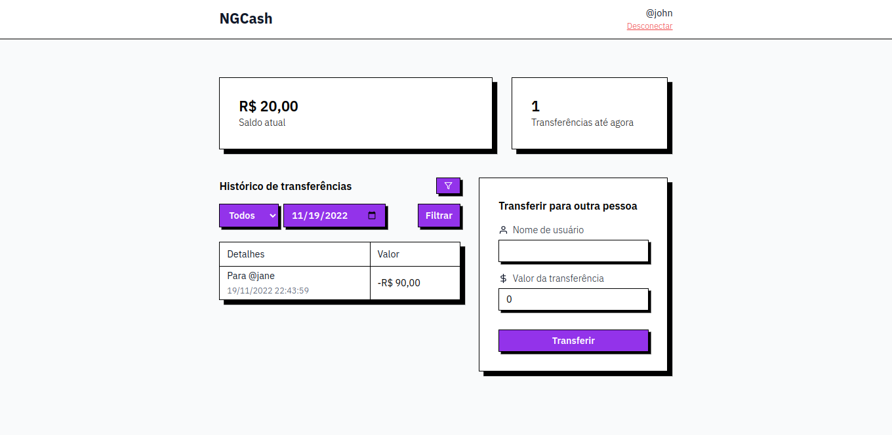
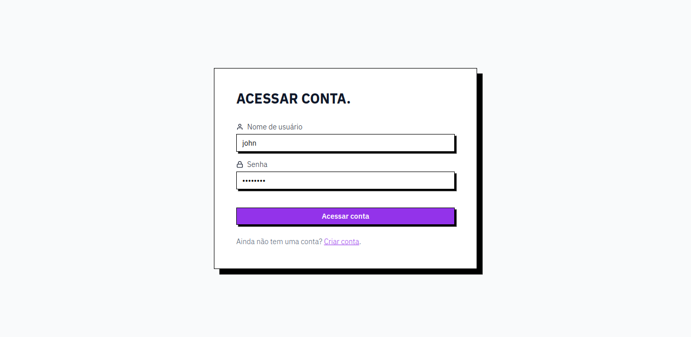
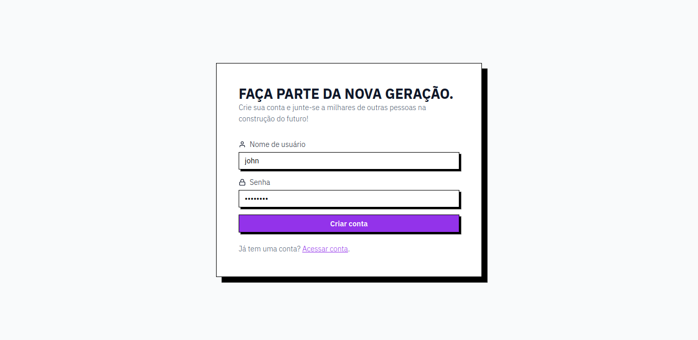

# NG.CASH Challenge

Projeto desenvolvido para teste técnico na NG Cash


<div align="center">
  
  
  
</div>

## :test_tube: Tecnologias

Tecnologias e ferramentas que foram utilizadas para desenvolver este projeto:

- [NodeJs](https://nodejs.org/)
- [Express](https://expressjs.com/pt-br/)
- [SWC](https://swc.rs/)
- [Jest](https://jestjs.io/)
- [Docker](https://www.docker.com/)
- [Prisma](https://www.prisma.io/)
- [TypeScript](https://typescriptlang.org/)
- [React](http://reactjs.org/)
- [NextJs](https://nextjs.org/)
- [TailwindCSS](https://tailwindcss.com/)

## :rocket: Como executar

1. Clone o repositório para sua maquina (`git clone https://github.com/miguel5g/ng-challenge.git`) ou baixe o zip do código fonte ([baixar](https://github.com/miguel5g/ng-cash-challenge/archive/refs/heads/main.zip)).

2. Acesse a pasta do projeto _(após descompactar ou clonar)_

- As próximas etapas pode ser feita de duas maneiras, escolha uma.

<details>
<summary>
  Utilizando docker compose
</summary>

3. Executar o comando para criar e executar os containers

```bash
docker compose up -d
```

_**OBS:** Na primeira vez esse processo vai demorar um pouquinho_

Após finalizar, basta acessar a url [localhost/sign-in](http://localhost/sign-in)

A aplicação já vem com dois usuários criados, você pode usar os dados abaixo para logar nas respectivas contas:

```txt
Username: jane
Password: 123456Aa
```

```txt
Username: john
Password: 123456Aa
```

</details>

<details>
<summary>
Com o node instalado na sua máquina
</summary>

3. Crie um banco de dados PostgreSQL _(Opcional)_

```bash
docker run --name <container name> -p 5432:5432 -e POSTGRES_PASSWORD=<database password> -e POSTGRES_USER=<database user> -d postgres
```

_**OBS:** Preencha com seus dados trocando os campos com <>_

4. Criar variáveis de ambiente

```bash
cp .env.example .env # server
```

```bash
cp .env.example .env # web
```

_**OBS:** Não esqueça de preencher as variáveis com seus dados_

5. Instale as dependências em cada projeto com npm (`npm install`)

```bash
npm install # server
```

```bash
npm install # web
```

6. Rode as migrations no banco de dados com prisma.

```bash
npm run prisma:deploy # server
```

7. Rode os dois projetos ao mesmo tempo com npm

```bash
npm run start:dev # server
```

```bash
npm run start:dev # web
```

</details>
